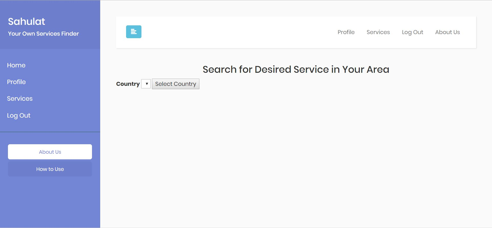
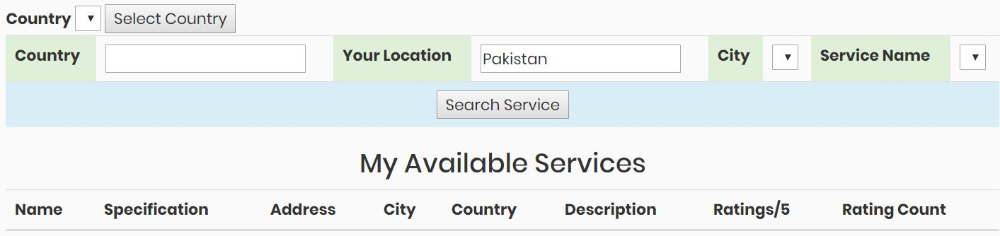
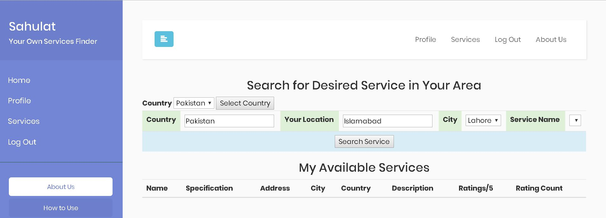
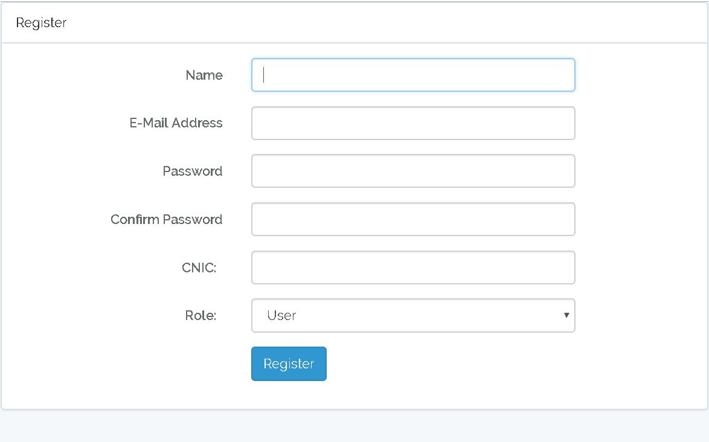

## Sahulat
'Sahulat' is a location based services optimization system.

>It is developed in Laravel (PHP), HTML, CSS, Javascript and MYSQL.
>It provides details about services available in a specific location in any city/country with their distances and ratings. The idea was to solve the problem of finding good service providers and to display best results based on cumulative ranking of their ratings and distance.
Providers could add data about their services and people could rate them and search according to the ratings.

## Project Demo 

## More

## More

## More

## More

## More

## More

