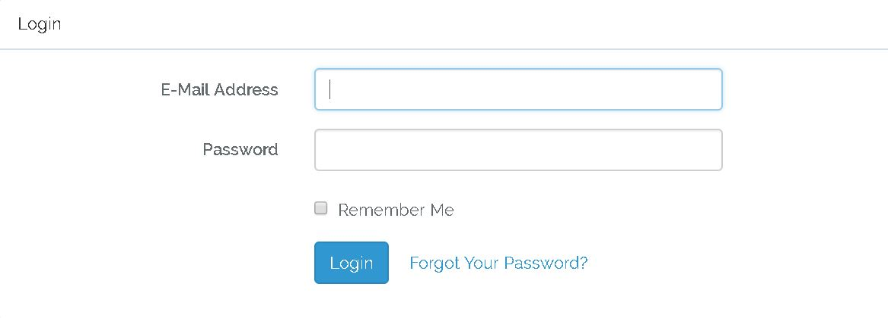

## Sahulat
'Sahulat' is a location based services optimization system.

>It is developed in Laravel (PHP), HTML, CSS, Javascript and MYSQL.
>It provides details about services available in a specific location in any city/country with their distances and ratings. The idea was to solve the problem of finding good service providers and to display best results based on cumulative ranking of their ratings and distance.
Providers could add data about their services and people could rate them and search according to the ratings.

To get started with setting up this app locally, make sure a database server (Wampp, Xampp) is installed. Also make sure Laravel and required dependencies are installed.

Import databaseproject.sql in Xampp/Wampp server, it will setup the database with all tables and constraints.

Modify the env file and set the appropriate database variables (dbname, username, localhost, password etc.)

cd to the project directory in command prompt/terminal and run the following command

```
php artisan serve
```

Open http://127.0.0.1:8000/ to run the app.

## Project Demo 


## Services filtere


## Services list


## Login screen


## Sign up screen


## Service providers sidebar


## Service provider menu


